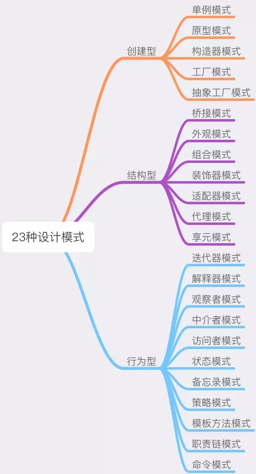

# 设计模式笔记

1. 设计模式相当于数学公式，是前人总结出来的经验
2. 设计模式的核心思想 --- 封装变化： **将变与不变分离，确保变化的部分灵活、不变的部分稳定。**

3. 设计模式最经典的 23 种。可分为：创建型，行为型，结构型

- 创建型模式封装了创建对象过程中的变化 比如工厂模式，它做的事情就是将创建对象的过程抽离
- 结构型模式封装的是对象之间组合方式的变化，目的在于灵活地表达对象间的配合与依赖关系
- 行为型模式则将是对象千变万化的行为进行抽离，确保我们能够更安全、更方便地对行为进行更改。



## 创建型：[工厂模式][1]

## 创建型：[单例模式][2]

## 创建型：原型模式

## 结构型：装饰器模式

在不改变原对象的基础上，通过对其进行包装拓展，使原有对象可以满足用户的更复杂需求

`ES7`已经实现装饰器语法糖，所谓的装饰器模式就是这东西的用法思路，就是在不影响原有实例的功能的情况下，扩展功能。比较适合别人写的代码功能上比较复杂，然后你要再这上面添加新的功能的时候，就像外挂一样舒适。

优秀代码库可以看看源码： https://github.com/jayphelps/core-decorators

## 结构型：适配器模式

主要是用来抹平差异。
例如：在开发中我们从`ajax`切换至`fetch` 项目中会有大量的对于`ajax`封装后的调用（我想你肯定不会每个请求都写一遍`ajax`）,再不改变这些的业务代码情况下，只改变封装`ajax`的方法，抹平两个库之间的差异，这种行为的方式就叫做适配器模式。写出来的东西就叫做适配器

相关生产实践： `axios` 在浏览器端和`Node`使用起来没有差异就是应用了适配器模式的优质实例。 核心逻辑：https://github.com/axios/axios/blob/master/lib/core/Axios.js

## 结构型：代理模式

A 不能直接访问 B，A 需要借助一个帮手来访问 B，这个帮手就是代理器。 （科学上网也是这个原理）

常用代理类型：

- 事件代理
  这个还是比较简单的，就是一个父元素代理多个子元素事件，原理事件的冒泡
- 虚拟代理
  图片的预加载，用一个虚拟元素`img`来加载真实图片地址，当图片加载完了再将占位图片元素的`src`改为真实图片`src`

  ```javascript
  class PreLoadImage {
    constructor(imgNode) {
      // 获取真实的DOM节点
      this.imgNode = imgNode;
    }

    // 操作img节点的src属性
    setSrc(imgUrl) {
      this.imgNode.src = imgUrl;
    }
  }
  class ProxyImage {
    // 占位图的 url 地址
    static LOADING_URL = "xxxxxx";

    constructor(targetImage) {
      // 目标Image，即PreLoadImage实例
      this.targetImage = targetImage;
    }

    // 该方法主要操作虚拟Image，完成加载
    setSrc(targetUrl) {
      // 真实img节点初始化时展示的是一个占位图
      this.targetImage.setSrc(ProxyImage.LOADING_URL);
      // 创建一个帮我们加载图片的虚拟Image实例
      const virtualImage = new Image();
      // 监听目标图片加载的情况，完成时再将DOM上的真实img节点的src属性设置为目标图片的url
      virtualImage.onload = () => {
        this.targetImage.setSrc(targetUrl);
      };
      // 设置src属性，虚拟Image实例开始加载图片
      virtualImage.src = targetUrl;
    }
  }
  ```

- 缓存代理
  当我们需要用到某个已经计算过的值的时候，不想再耗时进行二次计算，而是希望能从内存里去取出现成的计算结果。这种场景下，就需要一个代理来帮我们在进行计算的同时，进行计算结果的缓存了。
  代码并不是那么严谨 主要看思想

  ```javascript
  // addAll方法会对你传入的所有参数做求和操作
  const addAll = function() {
    console.log("进行了一次新计算");
    let result = 0;
    const len = arguments.length;
    for (let i = 0; i < len; i++) {
      result += arguments[i];
    }
    return result;
  };
  // 为求和方法创建代理
  const proxyAddAll = (function() {
    // 求和结果的缓存池
    const resultCache = {};
    return function() {
      // 将入参转化为一个唯一的入参字符串
      const args = Array.prototype.join.call(arguments, ",");

      // 检查本次入参是否有对应的计算结果
      if (args in resultCache) {
        // 如果有，则返回缓存池里现成的结果
        return resultCache[args];
      }
      return (resultCache[args] = addAll(...arguments));
    };
  })();
  ```

- 保护代理
  所谓“保护代理”，就是在访问层面做文章，在 getter 和 setter 函数里去进行校验和拦截，确保一部分变量是安全的

## 行为型：策略模式

将函数功能逻辑单一化，用映射方案替换`if-else`判断,代码可维护性更高

## 行为型：状态模式

与策略模式不同的是，策略模式中被封装出来的功能是单一的，没有联系的，如果这些功能之间有联系，比如某一个功能需要调用被封装出来的另一个功能，这个时候就要应用状态模式，做法就是用一个类封装，将封装状态方法的对象，放在类中。

## 行为型：[观察者模式][3]

## 行为型：迭代器模式

> 迭代器模式提供一种方法顺序访问一个聚合对象中的各个元素，而又不暴露该对象的内部表示。
> ——《设计模式：可复用面向对象软件的基础》

通俗的举个例子就是说，`javascript`中的遍历数组的`forEach`无法遍历类数组，而数组是集合，类数组也是集合 同样有遍历需求，我们却要针对不同的数据结构执行不同的遍历手段。

迭代器的定义就是遍历集合时，不需要关心集合的内部数据结构。

`ES6`中的迭代器：

```javascript
const arr = [1, 2, 3];
// 通过调用iterator，拿到迭代器对象
const iterator = arr[Symbol.iterator]();

// 对迭代器对象执行next，就能逐个访问集合的成员
iterator.next(); // {value: 1,done: false}
iterator.next();
iterator.next();
```

`for...of..`做的事情，基本等价于下面这通操作：

```javascript
// 通过调用iterator，拿到迭代器对象
const iterator = arr[Symbol.iterator]();

// 初始化一个迭代结果
let now = { done: false };

// 循环往外迭代成员
while (!now.done) {
  now = iterator.next();
  if (!now.done) {
    console.log(`现在遍历到了${now.value}`);
  }
}
```

`ES6`中的迭代器可以由生成器创建,生成器就是带`*`的函数，也就是说生成器函数返回的是一个迭代器对象

```javascript
// 编写一个迭代器生成函数
function* iteratorGenerator() {
  yield "1号选手";
  yield "2号选手";
  yield "3号选手";
}

const iterator = iteratorGenerator(); // 返回了一个迭代器

iterator.next();
iterator.next();
iterator.next();
```

用 `ES5`实现一个生成迭代器对象的迭代器生成函数

```javascript
function iteratorGenerator(list) {
  // 接收参数是一个集合
  var idx = 0; // 下标
  var len = list.length; // 长度
  return {
    next: function() {
      // 如果索引还没有超出集合长度，done为false
      var done = idx >= len;
      // 如果done为false，则可以继续取值
      var val = !done ? list[idx++] : undefined;
      // 将当前值与遍历是否完毕（done）返回
      return {
        value: val,
        done: done
      };
    }
  };
}
```

[1]: ./工厂模式
[2]: ./单例模式
[3]: ./观察者模式
